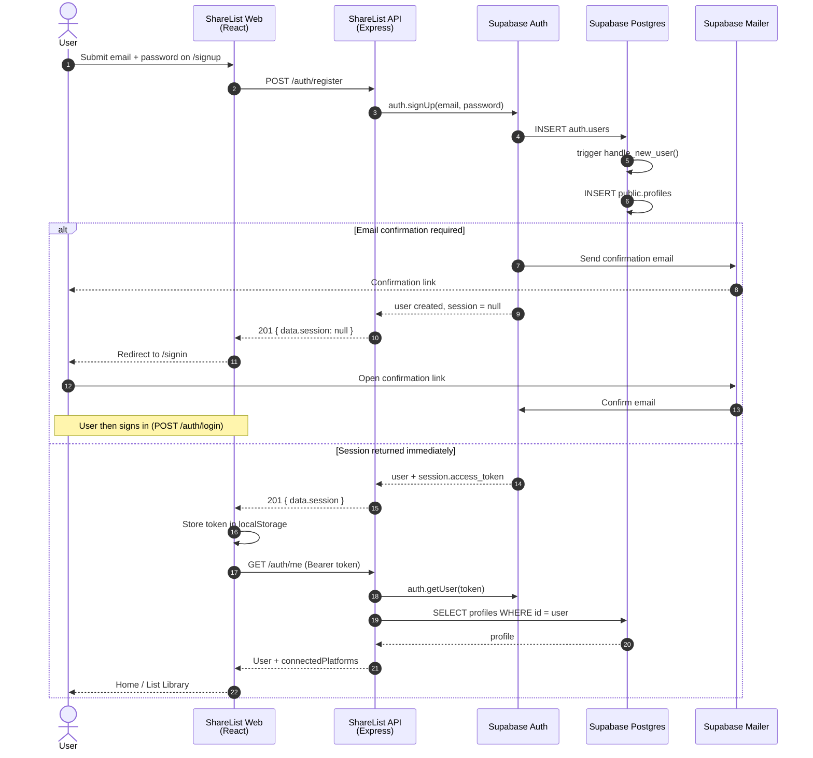
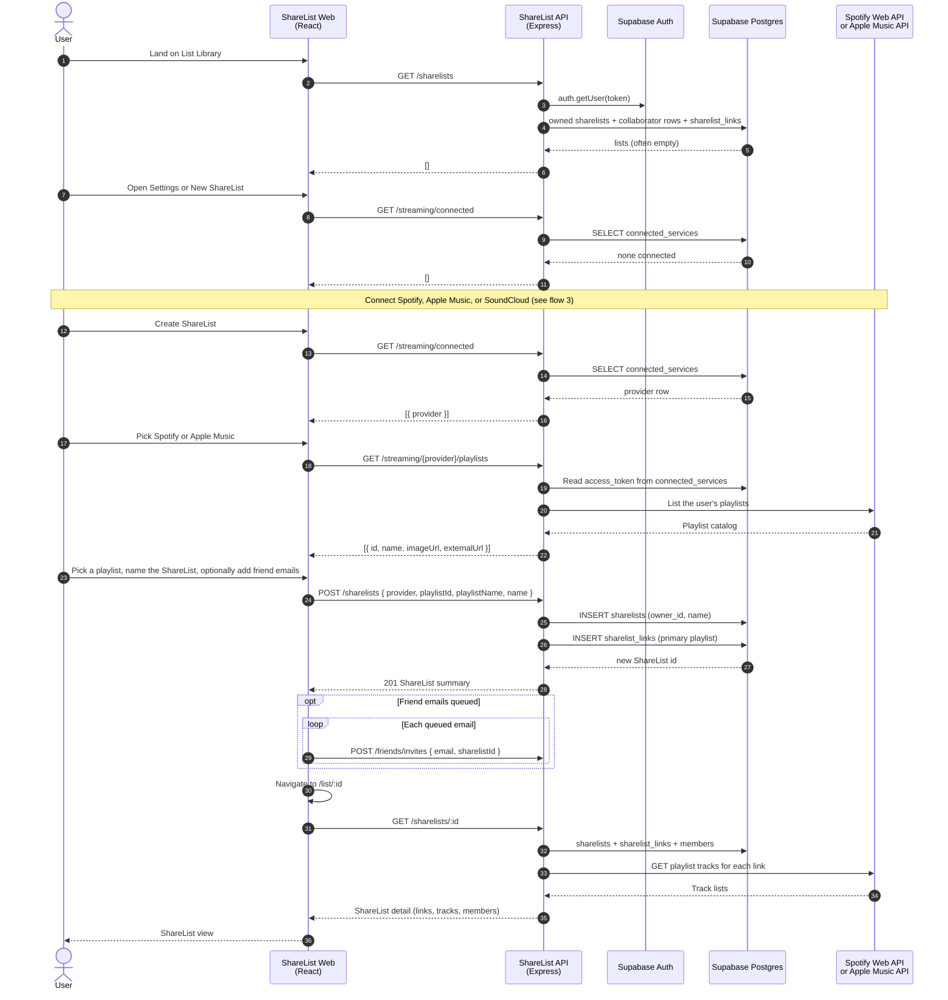
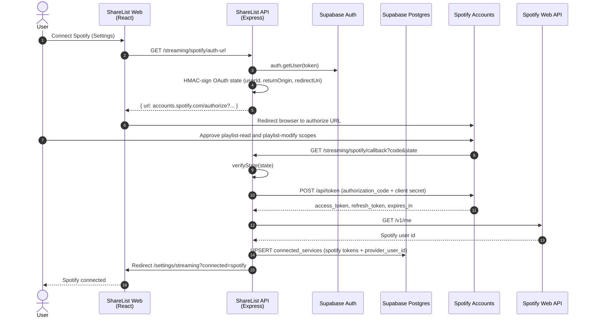
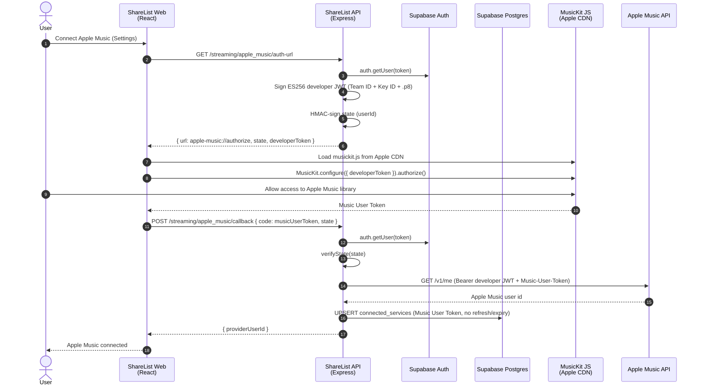
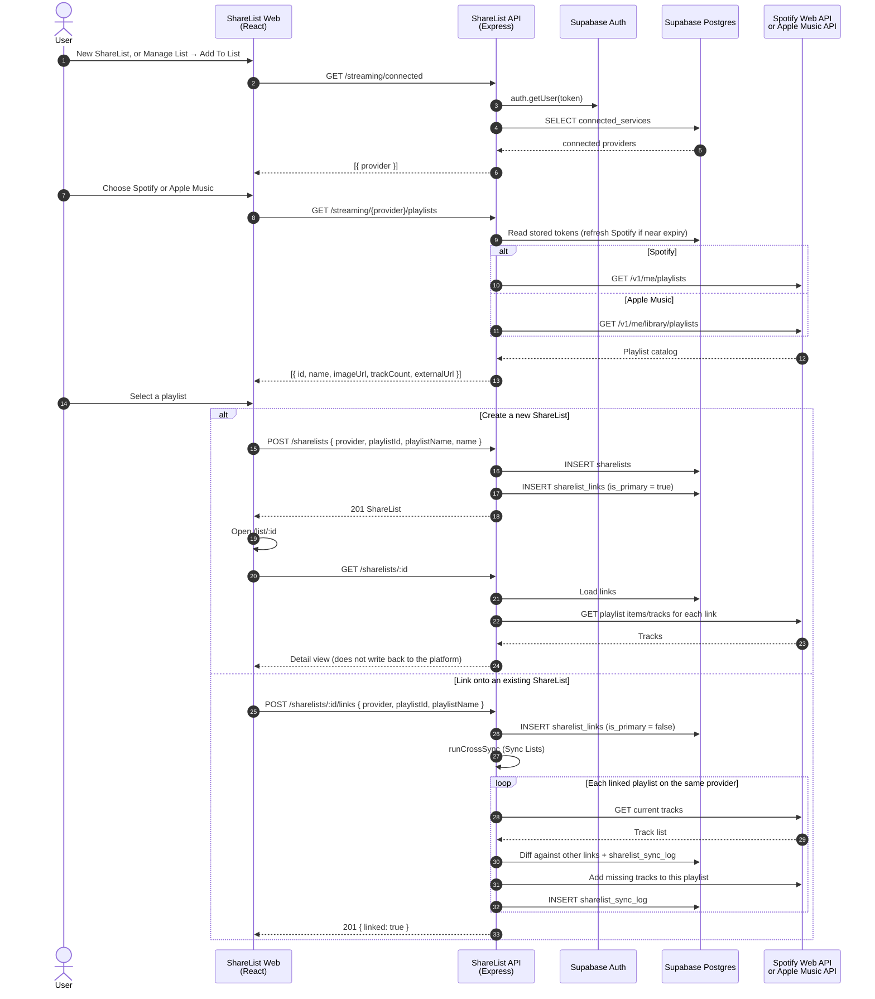
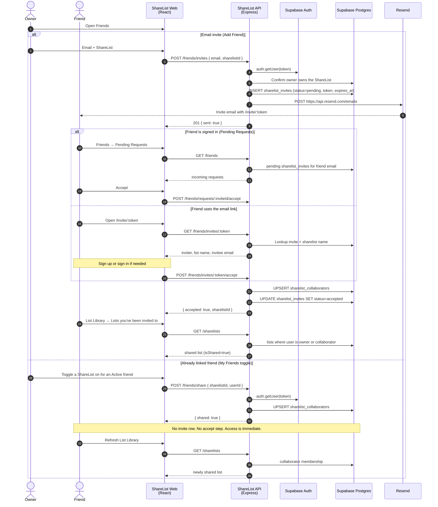

# Sharelist

Cross-platform music playlist sharing. Connect Spotify, Apple Music, or YouTube Music and share playlists across platforms — no matter which service your friends use.


<center>
  
  
  
</center>


## Quick start

```bash
git clone https://github.com/zhwatts/sharelist.git
cd sharelist
npm run setup
```

The setup command installs all dependencies and creates a `.env` file from the example template.

Then fill in your credentials in `.env` and start the development servers:

```bash
npm run dev
```

This runs the API (port 3001) and the frontend (port 5173) concurrently.

## Project structure

```
apps/
  api/    — Node/Express backend
  web/    — React frontend
packages/
  shared/ — Shared types and utilities
scripts/  — Automation and tooling scripts
```

## Environment variables

Copy `.env.example` to `.env` (the setup script does this automatically) and fill in the values below.

### Required to run locally

| Variable | Where to get it |
|---|---|
| `SUPABASE_URL` | Supabase project → Settings → API |
| `SUPABASE_ANON_KEY` | Supabase project → Settings → API |
| `SUPABASE_SERVICE_ROLE_KEY` | Supabase project → Settings → API (keep secret) |
| `VITE_SUPABASE_URL` | Same as `SUPABASE_URL` |
| `VITE_SUPABASE_ANON_KEY` | Same as `SUPABASE_ANON_KEY` |

### GitHub automation (scripts only)

| Variable | Notes |
|---|---|
| `GITHUB_TOKEN` | Personal access token — scopes: `repo`, `project` |
| `GITHUB_OWNER` | Your GitHub username |
| `GITHUB_REPO` | `sharelist` |
| `GITHUB_PROJECT_ID` | Numeric ID from the project board URL |

### Streaming service OAuth (only needed for those integrations)

| Variable | Where to get it |
|---|---|
| `SPOTIFY_CLIENT_ID` / `SPOTIFY_CLIENT_SECRET` | [Spotify Developer Dashboard](https://developer.spotify.com/dashboard) |
| `SPOTIFY_REDIRECT_URI` | Must match the URI registered in the Spotify app |
| `APPLE_MUSIC_TEAM_ID` / `APPLE_MUSIC_KEY_ID` / `APPLE_MUSIC_PRIVATE_KEY` | Apple Developer account |
| `SOUNDCLOUD_CLIENT_ID` / `SOUNDCLOUD_CLIENT_SECRET` | [SoundCloud app registration](https://soundcloud.com/you/apps) (Artist Pro required) |
| `SOUNDCLOUD_REDIRECT_URI` | Must match the URI registered in the SoundCloud app |
| `GOOGLE_CLIENT_ID` / `GOOGLE_CLIENT_SECRET` / `GOOGLE_REDIRECT_URI` | Google Cloud Console → APIs & Services → Credentials |

## Tech stack

- **Frontend:** React, TypeScript, Tailwind CSS, Vite
- **Backend:** Node.js, Express, TypeScript
- **Database & Auth:** Supabase (Postgres + Auth)
- **Deployment:** Vercel — two projects from this monorepo:
  - **ShareList** (`apps/web`) — Vite frontend
  - **ShareList-API** (`apps/api`) — compiled Express API

Environment variables live in each Vercel project's settings. The frontend deploys from git; the API is typechecked and transpiled in GitHub Actions, then deployed to the **ShareList-API** project.

## User flows

These diagrams follow the live code paths. The browser talks only to the ShareList API (`apps/api`). The API talks to vendors. Authenticated API calls send `Authorization: Bearer <access_token>`; the API validates that JWT with Supabase Auth (`auth.getUser`) and checks `profiles.status` before continuing.

YouTube Music is reserved in the schema and settings copy. **Spotify**, **Apple Music**, and **SoundCloud** are wired up today.

| Participant | Resource | Vendor |
|---|---|---|
| ShareList Web | React SPA (`apps/web`) | this repo |
| ShareList API | Express (`apps/api`) | this repo |
| Supabase Auth | Auth users, sessions, confirmation email | [Supabase](https://supabase.com) |
| Supabase Postgres | `profiles`, `connected_services`, `sharelists`, `sharelist_links`, `sharelist_collaborators`, `sharelist_invites`, `sharelist_sync_log`, `track_mappings` | [Supabase](https://supabase.com) |
| Spotify Accounts | OAuth authorize + token | [Spotify](https://developer.spotify.com) |
| Spotify Web API | Playlists and tracks | [Spotify](https://developer.spotify.com) |
| MusicKit JS | In-page Apple Music authorization | [Apple](https://developer.apple.com/musickit/) (CDN) |
| Apple Music API | Library playlists and tracks | [Apple](https://developer.apple.com/documentation/applemusicapi) |
| SoundCloud | OAuth 2.1 + playlists API | [SoundCloud](https://developers.soundcloud.com/docs/api/guide) |
| Resend | Invite email delivery | [Resend](https://resend.com) |

### 1. Account signup

Email/password registration. If Supabase requires email confirmation, no session is returned and the user signs in after confirming. If a session is returned, the web app stores the access token and loads the profile.



Sign-in is the same session handoff without creating a user: `POST /auth/login` → `auth.signInWithPassword` → `GET /auth/me`.

If signup started from an invite link (`/signup?invite=`), the web app also calls `GET /friends/invites/:token` to prefill the email, then `POST /friends/invites/:token/accept` after a session exists.

### 2. User onboarding

First session after an account exists: connect a music service, create a ShareList from one of that service's playlists, then open the list. Platform OAuth and playlist fetch are expanded in the next two diagrams.



### 3. Link a music platform

Tokens are stored in `connected_services` (Supabase Postgres), not in the browser. Spotify is a redirect OAuth code flow. Apple Music is MusicKit JS in the page: the API mints a developer JWT, the browser asks Apple for a Music User Token, then POSTs that token back.

#### Spotify



#### Apple Music



### 4. Fetch platform data and link a playlist

Two product paths share the same fetch. Creating a ShareList writes the first (primary) link. Linking another playlist onto an existing ShareList also runs **Sync Lists** (`runCrossSync`) so missing tracks are copied into each linked playlist when a match exists on that service.



**Fetch Songs** (`POST /sharelists/:id/sync`) is a later refresh of the same read path: it re-fetches playlist name, artwork, and tracks from the platform, writes metadata back to `sharelist_links`, and updates the ShareList view. It does not add songs on Spotify or Apple Music. **Sync Lists** (`POST /sharelists/:id/cross-sync`) is the write path that copies missing tracks into each linked playlist.

### 5. Share lists with other users

Sharing is per ShareList, not a separate friends graph. Two people become “friends” when they both have a `sharelist_collaborators` row. Email invites go through Resend and must be accepted. Toggling a list on for an already-linked friend grants access immediately.



Rejecting a pending request is `POST /friends/requests/:inviteId/reject` (`sharelist_invites.status = rejected`). Unsharing an already-linked list is `POST /friends/unshare`, which deletes that user's `sharelist_collaborators` row for that ShareList only.
